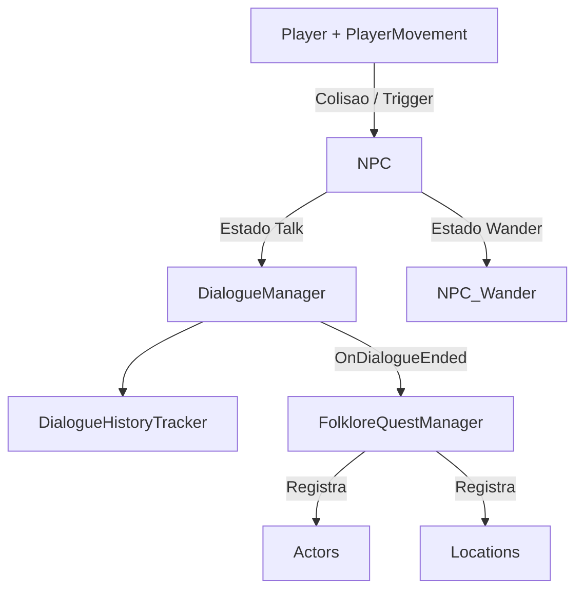
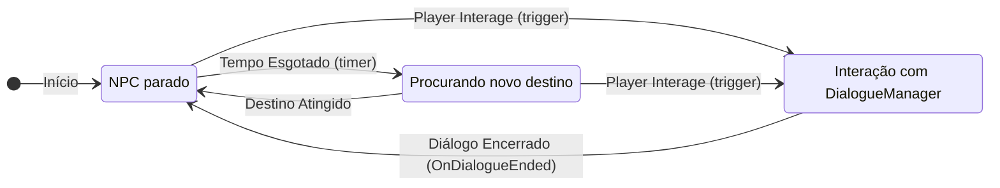

# Ecos da Mata (Unity)

Um jogo 2D exploratório e narrativo, desenvolvido em **Unity**, focado em exploração, inspirados em lendas e personagens do **folclore brasileiro**.

O aprendizado sobre o folclore no game é uma **consequência natural da curiosidade** e exploração do jogador, priorizando a profundidade narrativa e tratando o tema com seriedade e não como um "jogo educativo" tradicional.

---

## Motivação do Projeto

A maior parte dos jogos sobre folclore brasileiro é pensada como material didático infantil, com abordagens simplificadas. Este projeto busca subverter essa ideia com três objetivos principais:

* **Tratar o folclore com seriedade e respeito**, mostrando lendas, locais e personagens como elementos vivos da cultura brasileira.
* Colocar a **diversão e a exploração em primeiro lugar**: o jogador é motivado a falar com NPCs, investigar locais e seguir diálogos porque isso é essencialmente interessante.
* Usar o jogo como **meio, não como fim educativo**: o conhecimento surge dos diálogos, quest principal e descobertas, sem telas de “conteúdo didático” desconectadas da experiência.

---

## Documento de Design do Jogo (GDD)

O Game Design Document (GDD) do projeto está disponível no repositório e descreve todos os elementos de design, mecânicas, narrativa, personagens e diretrizes criativas do jogo.
Você pode acessá-lo aqui: [GDD](https://github.com/Alchini/TCC/blob/main/Ecos%20da%20Mata/Ecos%20da%20Mata%20GDD.docx)

--- 

## Dependências

### Software

* **Unity:** versão LTS recente (ex.: 2022.3.x ou superior).
* **.NET / C#:** versão padrão do pipeline do Unity usado no projeto.

### Testes

* **Unity Test Framework** (para testes PlayMode/EditMode).
* **NUnit** (já utilizado nos testes de NPC, como em `NPC_Wander_Tests`).

### Dependências de Projeto / Pacotes

* **TextMeshPro** para textos de UI de diálogo (`TMP_Text`).
* Sistema de áudio via `AudioManager` (utilizado em `PlayerMovement` e `NPC_Talk` para passos e sons de UI).

### Plataforma Alvo

* **Desktop** (Windows).
* **Controles:** Padrão via teclado.

---

## Modelagem Conceitual

Um resumo das principais entidades e suas responsabilidades, baseadas nos *scripts* do projeto:

| Entidade | Tipo | Responsabilidade Principal | Script de Referência |
| :--- | :--- | :--- | :--- |
| **Player** | `GameObject` | Movimento, direção, passos. | `PlayerMovement` |
| **NPC** | `GameObject` | Controle de estados (Idle/Wander/Talk), locomoção autônoma e início de diálogos. | `NPC`, `NPC_Wander`, `NPC_Talk` |
| **Actor** | `ActorSO` (*ScriptableObject*) | Dados de personagem: nome, retrato, etc. (usado em diálogos). | |
| **Diálogo** | `DialogueSO` (*ScriptableObject*) | Estrutura de falas, opções de resposta, fluxo de diálogo e UI. | `DialogueManager` |
| **Histórico** | `DialogueHistoryTracker` | Registra com quais atores o jogador já conversou. | `DialogueHistoryTracker` |
| **Locais** | `LocationSO` (*ScriptableObject*) | Pontos de interesse geográficos (igreja, cachoeira, floresta, etc.). | `FolkloreQuestManager` |
| **Quest Folclórica** | `FolkloreQuestManager` | Coordena progresso da *quest* principal com base em NPCs e locais descobertos. | `FolkloreQuestManager` |

---

## Arquitetura

### Visão Geral

A arquitetura do jogo é organizada em torno de três eixos centrais:

1.  **Exploração física:** Controlada pelo `PlayerMovement` e pelos scripts de movimentação de NPC (`NPC_Wander`).
2.  **Interação narrativa (diálogo):** Orquestrada pelo `DialogueManager`, que exibe falas, opções e registra o histórico via `DialogueHistoryTracker`.
3.  **Progresso de *quest* folclórica:** Coordenado pelo `FolkloreQuestManager`, que observa o término de diálogos e a visita a locais para atualizar a missão principal.

### Diagrama Simplificado de Arquitetura

O diagrama abaixo ilustra o fluxo de interação e dependências entre os componentes principais. **(Renderizável no GitHub com Mermaid)**

## Componentes Principais

### Movimento do Jogador (`PlayerMovement`)
* Lê eixos de entrada padrão **"Horizontal"** e **"Vertical"**.
* Usa **`Rigidbody2D.linearVelocity`** para controlar o movimento.
* Controla direção de *sprite* (flip horizontal), animações e efeito de **knockback**.
* Implementa lógica de *footsteps* (sons de passos) com *timer* e `AudioManager`.

### NPC e Sistema de Wander (`NPC`, `NPC_Wander`, `NPC_Talk`)
* **`NPC`:** Gerencia estados (`Default`, `Idle`, `Wander`, `Talk`), habilitando/desabilitando componentes apropriados.
* **`NPC_Wander`:** Define uma **área retangular de patrulha** (`WanderWidth`, `WanderHeigh`, `StartingPosition`), escolhe alvos aleatórios e pausa o NPC antes de um novo destino.
* **`NPC_Talk`:** Pausa o movimento, usa `DialogueManager` para iniciar/avançar diálogo ao pressionar o botão **"Interact"** e toca sons de UI.

### Sistema de Diálogo (`DialogueManager` + `DialogueSO` + `DialogueHistoryTracker`)
* **`DialogueManager`:** **Singleton** responsável por exibir UI (retrato, nome, texto), controlar a visibilidade da UI e os fluxos de diálogo (linhas + opções).
    * Expõe eventos **`OnDialogueStarted`** e **`OnDialogueEnded`**.
    * Guarda **`LastSpeaker`** (último `ActorSO` que falou) para uso da *quest*.
* **`DialogueHistoryTracker`:** Mantém um **`HashSet<ActorSO>`** com NPCs com quem o jogador já conversou e disponibiliza `HasSpokenWith(ActorSO)`.

### Sistema de Quest Folclórica (`FolkloreQuestManager`)
* Implementado como **singleton persistente** (`DontDestroyOnLoad`).
* Configura **`questStartDialogue`**, **`forceQuestStartLocation`**, e os arrays de `pontosDeInteresseNPCs` e `pontosDeInteresseLocais`.
* Escuta `DialogueManager.OnDialogueEnded` para **iniciar a *quest*** e **registrar o último NPC** que falou como ponto visitado, se for um dos configurados.
* Expõe **`TotalPontos`** e **`PontosDescobertos`** e o evento `OnQuestAtualizada`.

---

## Instruções de Execução

1.  **Em Desenvolvimento**: O game ainda não possui uma build própria gerada**

---

## Instruções de Uso e Extensão

### Adicionar um Novo NPC Folclórico

1.  Criar um **`ActorSO`** e um **`DialogueSO`**.
2.  Instanciar um prefab/base de NPC na cena com **`Rigidbody2D`**, **`Animator`**, **`NPC`**, **`NPC_Wander`** (e `NPC_Talk`).
3.  Ajustar: `StartingPosition`, `WanderWidth` e `WanderHeigh` para definir a área de patrulha (`NPC_Wander`).
4.  Se fizer parte da *quest*: Adicioná-lo ao array **`pontosDeInteresseNPCs`** do `FolkloreQuestManager`.

### Adicionar um Novo Local de Interesse

1.  Criar um **`LocationSO`**.
2.  Na cena, criar um `GameObject` com **`Collider2D` (trigger)** no local desejado.
3.  No script associado ao *trigger*, chamar:
    * `FolkloreQuestManager.Instance.NotifyLocationVisited(locationSO)` (para iniciar a *quest* se for o `forceQuestStartLocation`).
    * `FolkloreQuestManager.Instance.RegistrarLocal(locationSO)` (para registrar o local como descoberto, se estiver em `pontosDeInteresseLocais`).

---

## Testes Automatizados

O projeto inclui alguns testes usando o **Unity Test Framework / NUnit**.

### Exemplo - `NPC_Wander` – Teste de Área de Movimentação
O script de teste **`NPC_Wander_Tests`** verifica se o NPC sempre escolhe um novo alvo dentro da área configurada de *wander*.

### Como Rodar os Testes

1.  No Unity, abra **Window > General > Test Runner**.
2.  Selecione a aba **PlayMode** (ou EditMode).
3.  Localize a suíte de testes (ex.: `NPC_Wander_Tests`).
4.  Clique em **Run All** ou rode o teste individual.

---

## Registro de Decisões (ADR / Histórico)

A arquitetura reflete algumas **decisões importantes de engenharia**:

* **Singletons para sistemas centrais:** `DialogueManager`, `DialogueHistoryTracker` e `FolkloreQuestManager` são singletons para facilitar acesso global em um projeto de escopo reduzido.
* **Uso de `Rigidbody2D.linearVelocity` para movimento:** Movimento do jogador e NPCs é baseado em física simples, garantindo compatibilidade com colisões 2D e *knockback*.
* **Área de Wander em volta de `StartingPosition`:** `NPC_Wander` utiliza um retângulo centrado em `StartingPosition`, o que é coberto por testes automatizados.
* **Progressão de quest baseada em diálogo + local:** O design é focado em **descoberta de folclore** (falar com NPCs e visitar locais) como a forma de progredir.

---

## Trabalhos Futuros

* Evoluir o `NPC_Talk` com mais condições dinâmicas de diálogo.
* Expandir o sistema de *quests* para múltiplas linhas narrativas (ex.: diferentes regiões / lendas).
* Adicionar sistema de **journal/caderno** onde o jogador registra lendas e interpretações.
* Refinar *feedback* visual e sonoro para tornar a experiência de descoberta ainda mais marcante.
